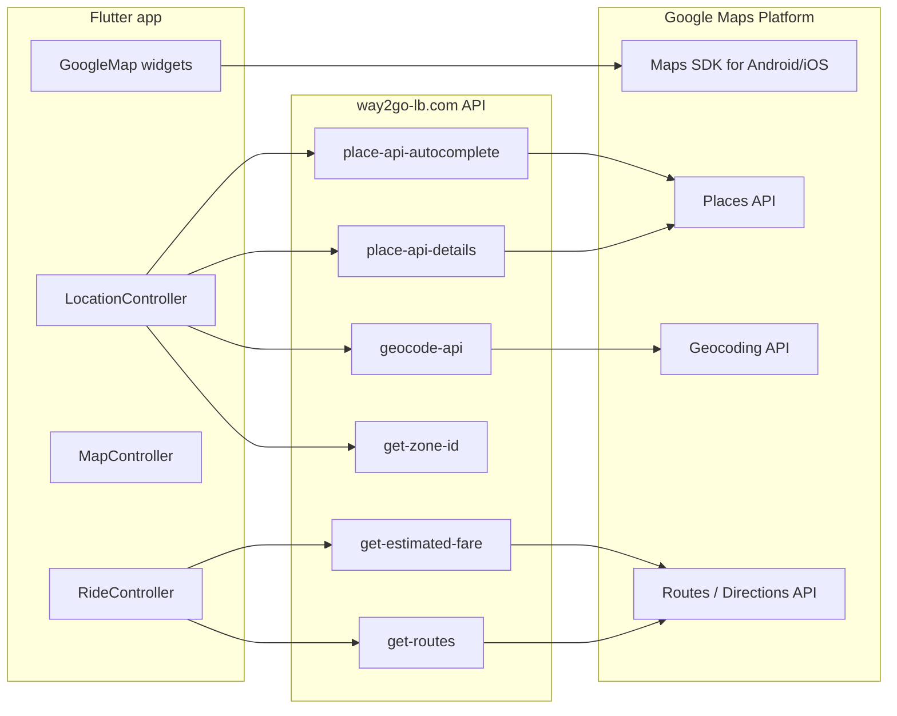

# Google Maps in Way2Go (User Mobile App)

This document describes how Google Maps is used in the **way2go-user-mobile** Flutter app, which Google products are involved, where API keys live, and how to estimate usage cost. It is based on the current codebase (`google_maps_flutter` + backend proxies on `https://way2go-lb.com`).

> **Last reviewed:** May 2026  
> **Official pricing changes:** Google Maps Platform updated billing in **March 2025** (free usage caps per SKU, expanded volume discounts). Always confirm numbers on the [pricing page](https://developers.google.com/maps/billing-and-pricing) and [pricing calculator](https://mapsplatform.google.com/pricing-calculator/).

---

## 1. Architecture overview

The app uses a **hybrid** model:

| Layer | Technology | Who pays Google |
|--------|------------|-----------------|
| **Map UI** (tiles, gestures, markers, polylines) | `google_maps_flutter` on device | Your **Maps SDK** API key (Android / iOS) |
| **Search, geocoding, routes, fare polylines** | HTTP calls to **Way2Go backend**, which proxies Google Web Services | Typically your **server** Google Cloud project (unless the backend uses another provider) |



**Important:** Most billable “search” and “address” events are **not** called from Dart directly against Google. They go through:

| App constant | Endpoint | Likely Google SKU |
|--------------|----------|-------------------|
| `addressesCatalogUri` | `/api/addresses` | **Client-side search** (no Google Places; cached 24h) |
| `searchLocationUri` | `/api/customer/config/place-api-autocomplete` | Places Autocomplete *(unused for search since May 2026)* |
| `placeApiDetails` | `/api/customer/config/place-api-details` | Place Details *(only if non-catalog `placeId`)* |
| `geoCodeURI` | `/api/customer/config/geocode-api` | Geocoding |
| `remainDistance` | `/api/customer/config/get-routes` | Routes / Directions |
| `estimatedFare` | `/api/customer/ride/get-estimated-fare` | Often includes route + distance (backend-dependent) |
| `getZone` | `/api/customer/config/get-zone-id` | Usually **your** zone logic (not a standard Maps SKU) |

The mobile app only **decodes** polylines returned by the backend (`MapController.decodeEncodedPolyline`) and draws them on the map—it does not call Directions from the client.

---

## 2. Dependencies and API keys

### Flutter package

- **`google_maps_flutter: ^2.14.0`** (`pubspec.yaml`)
- Transitive: `google_maps_flutter_android`, `google_maps_flutter_ios`, `geolocator` (device GPS; **not** billed by Google Maps)

### Where Maps SDK keys are configured (client)

| Platform | File | Purpose |
|----------|------|---------|
| Android | `android/app/src/main/AndroidManifest.xml` | `com.google.android.geo.API_KEY` |
| iOS | `ios/Runner/AppDelegate.swift` | `GMSServices.provideAPIKey(...)` |

These keys power **map display** (Dynamic Maps / Maps SDK loads) on each `GoogleMap` widget.

### Other keys in the repo

- **Firebase** keys in `google-services.json`, `GoogleService-Info.plist`, `lib/main.dart` — billing is under **Firebase**, not Maps SDK (unless misconfigured).
- **`ConfigModel.mapApiKey`** from `/api/customer/configuration` — loaded from backend as `map_api_key` but **not** wired into `GoogleMap` in the reviewed code; native keys above are used instead.

**Security recommendation:** Restrict each key in [Google Cloud Console](https://console.cloud.google.com/) (Android package + SHA-1, iOS bundle ID). Rotate any keys that were committed to git. Prefer separate keys for **Maps SDK (client)** vs **Web Services (server)**.

---

## 3. Where maps appear in the app

### 3.1 Screens and widgets with `GoogleMap`

| Location | Role |
|----------|------|
| `lib/features/map/screens/map_screen.dart` | Main ride/parcel tracking map; polylines, driver markers, live updates |
| `lib/features/location/view/pick_map_screen.dart` | Pick pickup/destination/extra stops on map; search dialog; Lebanon bounds |
| `lib/features/location/view/location_map_screen.dart` | View saved address on map (Lebanon camera bounds) |
| `lib/features/home/widgets/home_map_view.dart` | Home dashboard mini-map; nearby drivers |
| `lib/features/address/screens/add_new_address.dart` | Small map when adding an address |
| `lib/features/trip/screens/schedule_trip_map_view.dart` | Scheduled trip route preview |

### 3.2 Location feature (`lib/features/location/`)

| Component | Behavior |
|-----------|----------|
| `LocationController` | GPS (`geolocator`), zone check, search, geocode, place selection |
| `LocationSearchDialog` | Typeahead → `searchLocation(..., fromMap: true)` |
| `location_repository.dart` | Calls backend autocomplete with `components=country:lb` |
| `lebanon_geography.dart` | Bounds, `cameraTargetBounds`, `contains()` validation |
| Lebanon filter | After autocomplete, up to **15** `place-api-details` calls per search to keep only in-country results |

### 3.3 Search entry points (Places-related backend usage)

| Entry | File |
|-------|------|
| Map search overlay | `location_search_dialog.dart` |
| Address search screen | `search_and_pick_location_screen.dart` |
| Set destination (pickup / stops / destination) | `pick_location_widget.dart` → `set_destination_screen.dart` |
| Pre-filled destination search | `set_destination_screen.dart` (init) |

### 3.4 Map logic (`lib/features/map/`)

| Component | Behavior |
|-----------|----------|
| `MapController` | Markers, polylines from `RideController.encodedPolyLine`, fit bounds, nearest-driver markers |
| `RideController` | Fetches `encodedPolyline` from estimated fare / trip details; `remainDistance` during trip |
| Notifications / Pusher | Refresh polyline via `getPolyline()` when trip state changes |

### 3.5 Geocoding triggers (backend `geocode-api`)

Typical client calls:

- Current location on startup (`getCurrentLocation` → `initAddressAddressFromGeocode`)
- Map camera idle on `PickMapScreen` / `add_new_address` (`updatePosition` → `getAddressFromGeocode`)
- After moving pin (each idle event can trigger one geocode)

---

## 4. User journeys and API touchpoints

### A. First launch / access location

1. `AccessLocationScreen` → GPS or `PickMapScreen`
2. `getZone` + `geocode-api` for current/picked point
3. One **Maps SDK** load on pick map

### B. Book a ride (set destination)

1. Type in `PickLocationWidget` → **autocomplete** (+ Lebanon filter: up to **15 place details** per query)
2. Optional: open **PickMapScreen** → repeated **geocode** on camera idle
3. **get-estimated-fare** → backend likely **Directions/Routes** + returns `encodedPolyline`
4. **get-zone-id** on selected coordinates

### C. Active ride / parcel

1. **MapScreen** open for a long session → ongoing **Maps SDK** usage (tiles/load sessions)
2. `getPolyline()` draws route from stored polyline (no extra Directions call on client)
3. `remainDistance` (`get-routes`) may run during trip (backend)

### D. Home

1. **HomeMapView** → Maps SDK + `drivers-near-me` (app backend; not necessarily Google)

---

## 5. Google Maps Platform SKUs and billing

Costs fall into two buckets:

### 5.1 Client: Maps SDK (Android / iOS)

- **SKU:** Maps SDK for Android / iOS (often “Mobile Native Dynamic Maps” / map load)
- **When:** Each time a `GoogleMap` is created and loads tiles (home mini-map, pick map, full trip map, etc.)
- **Driver:** Session length, number of screens opened, pan/zoom (tile loads)

Rough list price (pay-as-you-go, verify on Google): on the order of **~$2–$7 per 1,000 map loads** depending on tier and region.

**March 2025+:** Essentials tier includes **monthly free event caps** per SKU instead of a flat $200 credit for all services.

### 5.2 Server: Web Services (via Way2Go API)

Billed on the **Google Cloud project attached to the backend**, not on the Flutter keys (unless the backend reuses the same key—avoid that).

| SKU | Triggered by app when | Typical list price (per 1,000, verify) |
|-----|------------------------|----------------------------------------|
| **Places Autocomplete** | Each `searchLocation` with non-empty text | ~$2–$3 (session/request model depends on API version) |
| **Place Details** | Selecting a suggestion; **each Lebanon filter check** (up to 15/search) | ~$5–$17+ (depends on fields requested) |
| **Geocoding** | `getAddressFromGeocode` / map idle / current location | ~$5 |
| **Routes / Directions** | `get-estimated-fare`, `get-routes`, trip routing on server | ~$5–$10 |

`get-zone-id` is usually **your** business logic and **not** a standard Maps line item unless the backend calls Google for it.

---

## 6. Expected usage cost (estimates)

These are **order-of-magnitude** examples for planning—not invoices. Use [Google’s calculator](https://mapsplatform.google.com/pricing-calculator/) with your real metrics.

### Assumptions

- Pay-as-you-go, no enterprise contract
- Prices before volume discounts; after free monthly caps where applicable
- Backend uses Google for autocomplete, details, geocoding, and directions
- **Lebanon filter enabled** (current `LocationController._filterSuggestionsToLebanon`)

### Per “booking” session (one user, one trip)

| Step | Events (approx.) | Notes |
|------|------------------|--------|
| Search pickup (8 keystrokes) | 8× autocomplete + 8×15 = **120 place details** (worst case) | Filter is the largest cost driver |
| Search destination (6 keystrokes) | 6× autocomplete + **90 place details** | Same |
| Map pick + geocode | 3× geocode | Camera idle |
| Estimated fare | 1× directions (server) | Returns polyline |
| MapScreen 15 min | 1–3 map load sessions | SDK |
| **Rough Web Services subtotal** | ~200 place details + 14 autocomplete + 3 geocode + 1 directions | See formula below |

**Illustrative Web Services cost for one heavy booking** (using ~$3/1k autocomplete, ~$5/1k details basic, ~$5/1k geocode, ~$5/1k directions):

- Autocomplete: 14 × $0.003 ≈ **$0.04**
- Place Details: 200 × $0.005 ≈ **$1.00**
- Geocoding: 3 × $0.005 ≈ **$0.02**
- Directions: 1 × $0.005 ≈ **$0.01**
- **≈ $1.07 per booking** (search-heavy path)

A lighter user (select first suggestion quickly, 2 searches × 5 keystrokes, filter returns few matches) might be **$0.15–$0.40** in Web Services per trip.

**Maps SDK:** If each trip opens 2–3 map UIs for ~10 minutes total, assume **~$0.02–$0.05** per trip at ~$7/1k loads (very rough).

### Monthly examples

| Monthly active riders | Trips / rider | Est. Maps cost / month (wide range) |
|----------------------|---------------|-------------------------------------|
| 500 | 4 | **$300 – $2,500+** |
| 2,000 | 6 | **$1,500 – $12,000+** |
| 10,000 | 8 | **$8,000 – $60,000+** |

The range is wide because:

1. **Lebanon filter** multiplies Place Details calls.
2. Typing speed and autocomplete debouncing change request counts.
3. Free tiers (post–Mar 2025) reduce early volume.
4. Backend may cache geocode/routes (not visible in the app).

### What does *not* cost Google Maps Platform

- `geolocator` / GPS on device
- Drawing markers/polylines from data you already have
- `get-zone-id`, `drivers-near-me`, trip list APIs (unless backend calls Google internally)

---

## 7. Cost optimization recommendations

1. **Way2Go address catalog:** Location search uses `GET /api/addresses` with in-app filtering (`Way2GoAddressCatalog`) — eliminates Places Autocomplete + per-keystroke Place Details for search.
2. **Debounce search** (400 ms) in `LocationController.searchLocation` and **geocode debounce** (600 ms) + in-memory geocode cache on map idle.
3. **Lebanon filter (legacy):** If you re-enable Google autocomplete, resolve details on the **server** or use `includedRegionCodes: ["lb"]` instead of up to 15× Place Details per keystroke.
3. **Separate API keys** and quotas: Maps SDK (client) vs Places/Geocoding/Directions (server only).
4. **Cache** geocode results for the same lat/lng on the backend.
5. **Confirm** `components=country:lb` is forwarded in `place-api-autocomplete` so autocomplete alone is Lebanon-biased.
6. Monitor [Google Cloud Billing → Maps SKUs](https://console.cloud.google.com/billing) and set budget alerts.
7. Review whether `map_api_key` from config should replace hardcoded native keys for easier rotation.

---

## 8. Lebanon-specific behavior (product)

- Search and selection are validated against `LebanonGeography` bounds.
- Map camera is restricted on `PickMapScreen` and `LocationScreen`.
- Autocomplete requests include `components=country:lb` when the backend forwards query parameters.

This reduces wrong-country picks but **increases Place Details usage** until search is optimized server-side.

---

## 9. Related files (quick index)

```
lib/features/location/
  controllers/location_controller.dart
  domain/repositories/location_repository.dart
  domain/lebanon_geography.dart
  view/pick_map_screen.dart
  view/location_map_screen.dart
  widget/location_search_dialog.dart

lib/features/map/
  screens/map_screen.dart
  controllers/map_controller.dart

lib/features/set_destination/
  widget/pick_location_widget.dart
  screens/set_destination_screen.dart

lib/util/app_constants.dart          # API paths
android/app/src/main/AndroidManifest.xml
ios/Runner/AppDelegate.swift
pubspec.yaml                         # google_maps_flutter
```

---

## 10. References

- [Google Maps Platform documentation](https://developers.google.com/maps/documentation)
- [Pricing overview](https://developers.google.com/maps/billing-and-pricing)
- [March 2025 billing changes](https://developers.google.com/maps/billing-and-pricing/march-2025)
- [Places API (New) usage and billing](https://developers.google.com/maps/documentation/places/web-service/usage-and-billing)
- [Geocoding API usage and billing](https://developers.google.com/maps/documentation/geocoding/usage-and-billing)
- [Maps SDK for Android](https://developers.google.com/maps/documentation/android-sdk/overview) / [iOS](https://developers.google.com/maps/documentation/ios-sdk/overview)

---

*For exact backend behavior (which Google APIs and fields are called), inspect the Way2Go server implementation of the `/api/customer/config/*` endpoints.*
